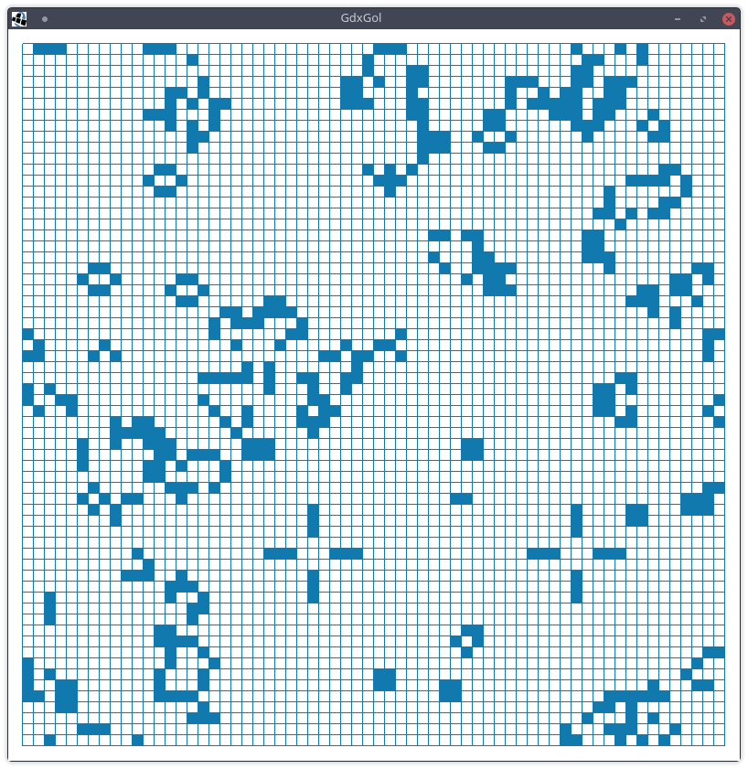

# GdxGol

A simple Game of Life with LibGDX

Interact:

R - randomize every cell

N - hold to step repeatedly

P - toggle pause/play

C - clear

SPACE - step once

LMB - turn cell on

RMB - turn cell off

ESC - quit
