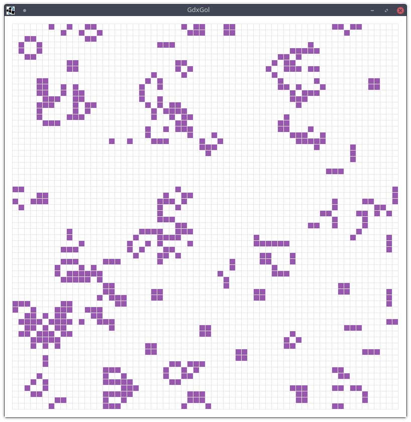

# GdxGol

A simple Game of Life with LibGDX

Interact:

R - randomize every cell

N - hold to step repeatedly

P - toggle pause/play

C - clear

F - forever mode: when (P)laying, it will spawn random clumps if not enough cells change in a generation. Nice for making seemingly-infinite simulations.

SPACE - step once

LMB - turn cell on

RMB - turn cell off

ESC - quit
